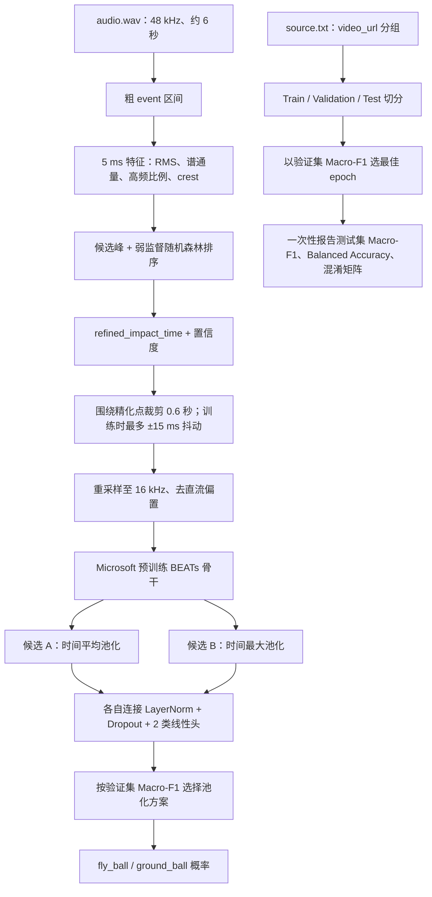

# BEATs：飞球 / 地滚球音频分类

本目录是当前测试数据的独立实验工程。任务是：**先在粗 event 区间附近精化真正的击球时间，再用该时间附近的音频判断 `fly_ball` / `ground_ball`**。原始 event 区间来自自动流程，可能偏宽；因此项目不会再把其简单中点当成默认真值。

## 已部署内容

- 数据：直接读取仓库根目录的 `dataset/{fly_ball,ground_ball}`，不会在模型目录重复保存数据。
- BEATs 官方代码：`third_party/unilm/beats`，来源为 Microsoft `unilm` 仓库，保留原许可证。
- 官方预训练权重放在 `checkpoints/BEATs_mirror/BEATs_iter3_plus_AS2M.pt`。权重体积约 345 MB，不提交到 Git；原始来源为 Microsoft 官方 BEATs 发布，本项目只使用其预训练表示，不使用 AudioSet 的 527 类输出头。

## 首次部署

在仓库根目录执行以下命令。数据使用仓库现有 `dataset/`，只需创建 Python 环境并取得 BEATs 权重：

```powershell
cd model_test
python -m venv .venv
.\.venv\Scripts\python.exe -m pip install -r requirements.txt
git clone --depth 1 https://huggingface.co/mooneyko/BEATs checkpoints/BEATs_mirror
```

## 正确运行顺序：先精化时间，再训练

第一步在原始 48 kHz 音频上运行“RMS / 谱通量 / 高频比例等冲击特征 + 随机森林”的弱监督定位器：

```powershell
cd baseball-multimodal-dataset\model_test
python refine_impact_times.py --config localizer_config.json
```

它会生成 `outputs/refined_events/refined_events.csv`，其中保留原始 event 区间、精化后的 `refined_impact_time`、置信度、相对粗中点的偏移与审核状态；并生成按风险排序的 `manual_review_priority.csv`。它**不会修改**原始 `sample.csv`。`needs_manual_review` 表示候选峰不够明确，或精化时间相对粗中点偏移超过 200 ms；应优先试听或查看波形。默认 BEATs 训练只读取置信度不低于 0.60、且状态为 `auto_usable` 的精化时间。

第二步才训练 BEATs：

在 VS Code 打开本目录后，在终端执行：

```powershell
cd baseball-multimodal-dataset\model_test
.\.venv\Scripts\python.exe train_beats_classifier.py --config config.json
```

训练产物会写入自动带时间戳的 `outputs/beats_YYYYMMDD_HHMMSS/`。如需固定名称以便复现实验，可额外加上 `--run-name beats_crop1s_seed42`；同名目录已经存在时，脚本会拒绝覆盖旧结果。目录中包含：

- `best_model.pt`：验证集 Macro-F1 最佳的权重；
- `metrics.json`：最终仅评估一次的测试集指标与混淆矩阵；
- `history.json`：每个 epoch 的损失和验证指标；
- `splits.json`：本次 train/val/test 的样本划分，确保可以复现。

GPU 可用时自动使用 RTX 4060 与混合精度；CPU 也能运行，但会慢很多。项目会拒绝任何 `max_epochs > 30` 的配置。

## 参数说明：先保持默认，再一次只改一个参数

| 参数 | 默认值 | 可以怎么调 | 会造成什么影响 |
|---|---:|---|---|
| `audio.target_sample_rate` | 16000 | 不建议改 | 官方 BEATs 的特征提取按 16 kHz 设计。保留原始 48 kHz 文件即可，读取时自动重采样。 |
| `audio.crop_seconds` | 0.6 s | 0.4、0.6、0.8 | 窗口围绕**精化后的击球点**裁剪。小窗口更聚焦撞击；窗口过大容易引入解说、观众声或剪辑风格。建议先比较 0.4 / 0.6 / 0.8。 |
| `audio.train_crop_jitter_seconds` | 0.015 s | 0--0.04 | 模拟定位器残余误差。过大可能让短促击球声偏离窗口；验证/测试永不抖动。 |
| `audio.peak_normalize` | false | true/false | `false` 保留响度信息；`true` 消除录音音量差，但也可能抹去真实击球强弱。先用 false，再做消融比较。 |
| `model.head_dropout` | 0.35 | 0.2--0.5 | 较高可抑制过拟合；超过 0.5 常使小数据训练欠拟合。 |
| `model.pooling_candidates` | `mean`、`max` | 可只保留一种 | 两种候选会在相同数据划分和随机种子下分别训练，并按验证集 Macro-F1 选择胜者；两种都启用时训练耗时约翻倍。 |
| `model.unfreeze_last_blocks` | 0 | 1 或 2 | 0 只训练分类头，适合当前小数据实验。解冻后可能更贴合棒球声音，但训练更慢、更容易只记住训练集；保持很低的 `backbone_learning_rate`。 |
| `augmentation.gain_db` | 4 dB | 2--6 dB | 防止模型只依赖录音音量。太大则生成不自然音量。 |
| `augmentation.gaussian_noise_std` | 0.002 | 0--0.005 | 对压缩/背景扰动有一定鲁棒性；数值过高会淹没撞击瞬态。 |
| `training.batch_size` | 8 | 4--16 | 更大更快但显存占用更多。RTX 4060 显存不足时先降为 4。 |
| `training.head_learning_rate` | 1e-3 | 3e-4--2e-3 | 分类头学习速度。训练不收敛可提高一点，验证集忽高忽低可降低。 |
| `training.backbone_learning_rate` | 1e-5 | 1e-6--3e-5 | 仅在解冻 block 时生效；过大极易破坏预训练表示。 |
| `training.max_epochs` | 20 | 10--30 | 上限被代码强制限制为 30；实际常会被早停提前结束。 |
| `training.early_stopping_patience` | 10 | 4--12 | 验证 Macro-F1 连续多少轮未提升后停止。过小可能错过晚期提升，过大则浪费时间。 |
| `training.use_mixed_precision` | false | 暂不建议开启 | 本机 RTX 4060 上，官方 BEATs 前端直接使用 FP16 会产生 NaN。代码已强制 BEATs 骨干保持 FP32；默认关闭混合精度最稳妥。 |

### 定位器参数（`localizer_config.json`）

| 参数 | 默认值 | 调整影响 |
|---|---:|---|
| `audio.frame_seconds` / `hop_seconds` | 25 ms / 5 ms | 控制分析粒度。hop 降到 2.5 ms 会提高时间精度但约翻倍运行时间，且更易受噪声影响；5 ms 是当前平衡点。 |
| `audio.search_padding_seconds` | 80 ms | 在原始 event 区间两端额外搜索的范围。增大能容忍边界偏差，但过大（如 >250 ms）会更容易把解说或欢呼选成击球。 |
| `audio.minimum_peak_distance_seconds` | 30 ms | 两个候选峰的最小间隔。太小会把同一声撞击重复计为多个峰；太大可能合并很近的真实瞬态。 |
| `weak_labels.positive_radius_seconds` | 10 ms | 将候选撞击峰周围多少帧当作 RF 弱正样本。较大更稳定，但会重新引入“宽标签”问题。 |
| `weak_labels.negative_exclusion_seconds` | 60 ms | 与候选峰相隔至少多远才可作负样本。过小会把撞击尾声错标为负样本。 |
| `random_forest.n_estimators` | 400 | 树越多，排序更稳定但处理更慢；300--600 一般足够。 |
| `random_forest.max_depth` | 12 | 越深越容易记住弱标签噪声；8--14 是合理搜索范围。 |
| `selection.minimum_confidence_for_beats` | 0.60 | BEATs 接纳精化时间的最低阈值。提高阈值可提升时间可靠性但会减少训练样本；降低阈值相反。 |
| `selection.review_if_shift_from_raw_midpoint_seconds` | 0.20 s | 精化峰与粗中点偏移超过该值时强制人工复核。偏移大未必错误，但绝不应仅凭弱监督置信度自动采纳。 |

## 如何判断结果可信

不要只看 Accuracy，因为当前 fly/ground 数量不平衡。主指标为：

- **Macro-F1**：两类同等重要时的首选指标；
- **Balanced Accuracy**：分别计算两类召回率再平均；
- **混淆矩阵**：检查模型是否把少数类 fly_ball 几乎全部错判；
- 使用 `splits.json` 固定测试集，测试集分数不能被反复拿来调参。

训练脚本以 `source.txt` 内的 `video_url` 为分组键切分，防止未来同一视频的多个片段同时进入训练和测试。模型输入只读取 `audio.wav`，绝不使用 `landing_zone`、`region`、`trajectory_type` 或 `bounce` 等字段，避免标签泄漏。

## 单音频预测

```powershell
python predict_beats_classifier.py `
  --model outputs\beats_crop1s_seed42\best_model.pt `
  --audio ..\dataset\fly_ball\Codex_Workstation\F_001\audio.wav `
  --impact-time 0.99
```

`impact-time` 是精化定位器输出的 `refined_impact_time`（秒），而不是粗标注中点。可从 `outputs/refined_events/refined_events.csv` 读取。

## 工程线框图



## 后续实验顺序

1. 先运行时间精化并人工抽查 `needs_manual_review` 的高风险样本。
2. 固定同一 split，分别比较 0.4、0.6、0.8 秒精化对齐窗口。
3. 若验证集稳定提升，再试 `unfreeze_last_blocks=1`；不能同时更改窗口、增强和学习率。
4. 用你原有的 RMS/onset/RF 定位器产生时间点，比较其与人工时间点带来的分类性能差。
5. 如果人工对齐时 Macro-F1 仍接近随机水平，不应靠堆更大音频模型硬做；应将视频作为球路判断主分支，音频仅作辅助。
